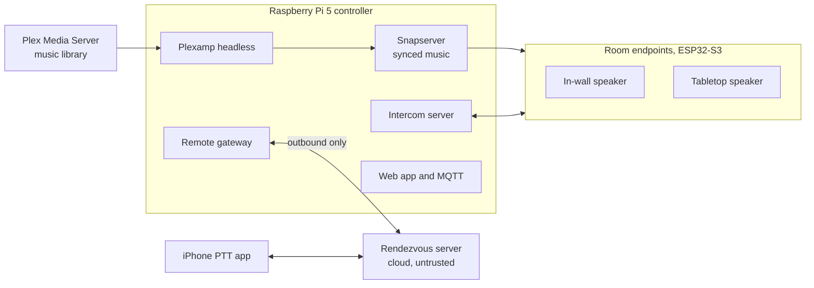

# Home Audio and Intercom

Whole-home synchronized music and a push-to-talk intercom you build yourself. A Raspberry Pi runs the house. Small ESP32-S3 speakers in each room play the music and carry the pages. A paired iPhone app pages the house from anywhere. Plex hosts the music library.


> **Status: design stage.** The system design and the first printable enclosure are here. No firmware, controller software, or phone app has been written yet, and the enclosure has not been printed or tested. Expect things to change.

## What it does

- **Music in every room, in sync.** Pick music in Plex and it plays through the whole house with no echo between rooms.
- **Push-to-talk intercom.** Hold TALK in any room to page every other room. Music ducks while someone is talking, then comes back.
- **Priority page.** Double-press TALK to get through to rooms that are turned down.
- **Phone app.** A paired iPhone can page the house and hear house pages from anywhere, with no VPN and no open ports at home.
- **Works through a power blip.** The tabletop speaker has a battery that keeps it online for hours.

## Privacy comes first

A microphone in every room has to be provably off.

- A room's mic has power only while someone in that room is holding TALK **and** that room's mic mute is off.
- Both conditions are wired in hardware. The firmware can see the state but has no wire that can change it, so a software bug or a compromised device cannot turn a mic on.
- A red light shows mic mute. It is driven by the same hardware latch, so it cannot be faked.
- Nothing remote can listen to a room. The phone app can talk to the house and hear a page that someone in the house chose to send. That is all.
- The cloud server that connects phones to the house only passes along encrypted audio it cannot decrypt.

## How it fits together



| Part | What it is |
|---|---|
| Controller | Raspberry Pi 5 running Snapcast for music, the intercom server, MQTT, and a local web app |
| Media library | Plex Media Server. A headless Plexamp player on the Pi feeds Snapcast, so Plex is the remote control for the house |
| In-wall endpoint | ESP32-S3, 2 in. speaker, and mic behind a printed plate in a double-gang box, PoE preferred |
| Tabletop endpoint | ESP32-S3, 2.5 in. woofer and dome tweeter in a folded transmission line, USB-C power, battery backup |
| Phone app | iPhone push-to-talk app using WebRTC and Apple's PushToTalk framework |
| Rendezvous server | A small cloud server that helps the phone and the house find each other. It relays encrypted audio and never holds the keys |

The full design, including the mic privacy circuit, the audio processing chain, and the remote intercom trust model, is in **[docs/design.md](docs/design.md)**.

## The tabletop speaker

| | |
|---|---|
|  |  |

- 250 x 173 x 84 mm. Prints on a Bambu Lab A1 (256 mm bed) in PETG with no supports.
- Dayton Audio CE70PR-4 2.5 in. woofer and ND16FA-6 tweeter, one amp channel each, with the crossover and EQ done in software.
- A folded transmission line about 730 mm long behind the woofer, tuned to about 115 Hz.
- Four real buttons on top: TALK, volume down, volume up, and mic mute. No screws on top; they come in from the bottom.
- A cloth grille on a printed ring that snaps on with magnets.

### Print it or change it

| File | Print orientation |
|---|---|
| `hardware/tabletop/base.stl` | Floor on the bed |
| `hardware/tabletop/lid.stl` | Top face on the bed |
| `hardware/tabletop/button_caps.stl` | Cap tops on the bed |
| `hardware/tabletop/grille_ring.stl` | Front face on the bed |

Every dimension is a named parameter at the top of `tabletop_endpoint.py`. Change one and regenerate:

```
cd hardware/tabletop
pip install manifold3d trimesh numpy pillow matplotlib
python3 tabletop_endpoint.py     # writes the STLs
python3 render_views.py          # writes preview images to renders/
python3 render_plan.py           # writes the line layout to renders/
```

Dimensions marked `VERIFY` in the script are estimates. Check them against the parts in hand before printing.

## What is in this repo

| Folder | What it holds | Status |
|---|---|---|
| [`docs/`](docs/) | System design | Current |
| [`hardware/tabletop/`](hardware/tabletop/) | Tabletop enclosure: generator, STLs, renders | First design, not yet printed |
| [`firmware/endpoint/`](firmware/endpoint/) | ESP32-S3 firmware for both endpoint types | Not started |
| [`controller/`](controller/) | Pi 5 services | Not started |
| [`remote/`](remote/) | Remote intercom: Pi gateway, rendezvous server, iPhone app | Not started |

## Roadmap

- [x] System design
- [x] Tabletop enclosure, first design
- [ ] Print and fit-check the tabletop enclosure
- [ ] Mic privacy board (latch, load switches, buffer)
- [ ] Endpoint firmware: music playback, then intercom, then audio tuning
- [ ] Controller: Snapcast, Plexamp, intercom server, web app
- [ ] In-wall plate with four buttons
- [ ] Remote intercom on the local network (web page)
- [ ] Rendezvous server and iPhone app

## Feedback

Ideas, corrections, and questions are welcome. Open an [issue](../../issues). Review of the mic privacy circuit and the remote intercom trust model is especially useful.

## License

No license has been chosen yet. Until one is added, the contents are published for reading and all rights are reserved.
