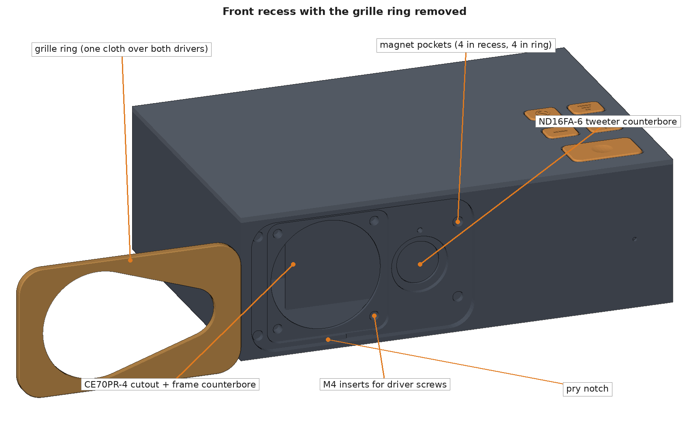
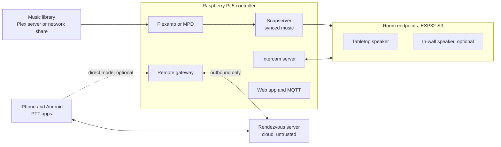
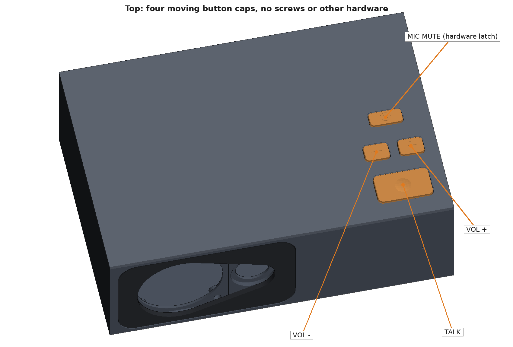
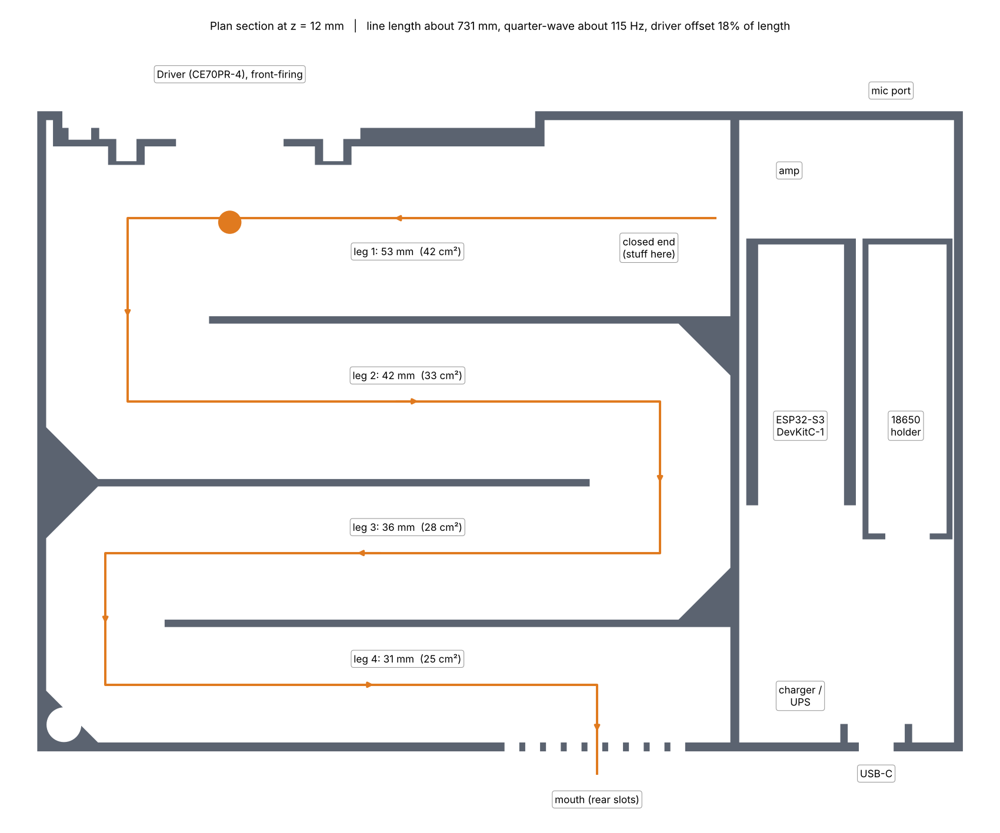

# Holler

**Whole-home audio and intercom.** Synchronized music in every room and a push-to-talk intercom, built yourself. A Raspberry Pi runs the house. Small ESP32-S3 speakers in each room play the music and carry the pages. Paired iPhone and Android apps page the house from anywhere. The music comes from Plex or from a plain network share.



> **Status: design stage.** The system design and the first printable enclosure are here. No firmware, controller software, or phone app has been written yet, and the enclosure has not been printed or tested. Expect things to change.

The name comes from what it replaces, hollering across the house, and from "hoot-n-holler," the old term for an always-open intercom line.

## What it does

- **Music in every room, in sync.** One stream plays through the whole house with no echo between rooms.
- **Your library, two ways.** Use Plex and pick music in Plexamp (needs a Plex Pass), or point it at a network share and pick music from a web page or any MPD app, with no account at all.
- **Background mode.** Any room can switch to a soft "music from the other room" sound for dinner or conversation, while the rest of the house plays normally. One button on the speaker turns it on or off, and the server can schedule it.
- **Push-to-talk intercom.** Hold TALK in any room to page every other room. Music ducks while someone is talking, then comes back.
- **Priority page.** Double-press TALK to get through to rooms that are turned down.
- **Phone apps.** A paired iPhone or Android phone can page the house and hear house pages from anywhere, with no VPN.
- **Two ways to reach home.** By default the phone and the house meet through a small server you host, and no port is opened at home. A simpler direct option forwards two ports instead, with no server to run, at the cost of exposing a service at home.
- **Works through a power blip.** The tabletop speaker has a battery that keeps it online for hours.

## Privacy comes first

A microphone in every room has to be provably off.

- A room's mic has power only while someone in that room is holding TALK **and** that room's mic mute is off.
- Both conditions are wired in hardware. The firmware can see the state but has no wire that can change it, so a software bug or a compromised device cannot turn a mic on.
- A red light shows mic mute. It is driven by the same hardware latch, so it cannot be faked.
- Nothing remote can listen to a room. The phone app can talk to the house and hear a page that someone in the house chose to send. That is all.
- Whatever sits between a phone and the house, a hosted server or the open internet, only ever carries encrypted audio it cannot decrypt.

## How it fits together



| Part | What it is |
|---|---|
| Controller | Raspberry Pi 5 running Snapcast for music, the intercom server, MQTT, and a local web app |
| Music library | Plex mode: Plex Media Server with a headless Plexamp player on the Pi, controlled from Plexamp. Share mode: a network share played by MPD on the Pi, controlled from a web page or any MPD app. Either one feeds Snapcast |
| Tabletop endpoint | ESP32-S3, 2.5 in. woofer and dome tweeter in a folded transmission line, USB-C power, battery backup. This is the reference build |
| In-wall endpoint (optional) | ESP32-S3, 2 in. speaker, and mic behind a printed plate in a double-gang box, PoE preferred. Same electronics and firmware. Parts are modeled, not yet printed |
| Phone apps | Push-to-talk apps for iPhone (WebRTC and Apple's PushToTalk framework) and Android (WebRTC and a foreground service) |
| Rendezvous server (default) | A small hosted server that helps the phone and the house find each other and punch through to each other. It relays encrypted audio and never holds the keys |
| Direct mode (optional) | No hosted server. The router forwards two ports to the Pi's remote gateway. Simpler and free, but it exposes a service at home to the internet |

The full design, including the mic privacy circuit, the audio processing chain, and the remote intercom trust model, is in **[docs/design.md](docs/design.md)**.

## The tabletop speaker

| | |
|---|---|
|  |  |

- 250 x 173 x 84 mm. Prints on a Bambu Lab A1 (256 mm bed) in PETG with no supports.
- Dayton Audio CE70PR-4 2.5 in. woofer and ND16FA-6 tweeter, one amp channel each, with the crossover and EQ done in software.
- A folded transmission line about 730 mm long behind the woofer, tuned to about 115 Hz.
- Five real buttons on top: TALK, volume down, volume up, mic mute, and background mode. No screws on top; they come in from the bottom.
- A cloth grille on a printed ring that snaps on with magnets.

### Print it or change it

| File | Print orientation |
|---|---|
| `hardware/tabletop/base.stl` | Floor on the bed |
| `hardware/tabletop/lid.stl` | Top face on the bed |
| `hardware/tabletop/button_caps.stl` | Cap tops on the bed |
| `hardware/tabletop/grille_ring.stl` | Front face on the bed |

Every dimension is a named parameter at the top of `tabletop_endpoint.py`. Change one and regenerate:

```
cd hardware/tabletop
pip install manifold3d trimesh numpy pillow matplotlib
python3 tabletop_endpoint.py     # writes the STLs
python3 render_views.py          # writes preview images to renders/
python3 render_plan.py           # writes the line layout to renders/
```

Dimensions marked `VERIFY` in the script are estimates. Check them against the parts in hand before printing.

## What is in this repo

| Folder | What it holds | Status |
|---|---|---|
| [`docs/`](docs/) | System design | Current |
| [`hardware/tabletop/`](hardware/tabletop/) | Tabletop enclosure: generator, STLs, renders | First design, not yet printed |
| [`hardware/inwall/`](hardware/inwall/) | In-wall endpoint (optional): generator, STLs, renders | First design, not yet printed |
| [`firmware/endpoint/`](firmware/endpoint/) | ESP32-S3 firmware for both endpoint types | Not started |
| [`controller/`](controller/) | Pi 5 services | Not started |
| [`remote/`](remote/) | Remote intercom: Pi gateway, rendezvous server, iPhone and Android apps | Not started |

## Roadmap

- [x] System design
- [x] Tabletop enclosure, first design
- [ ] Print and fit-check the tabletop enclosure
- [ ] Mic privacy board (latch, load switches, buffer)
- [ ] Endpoint firmware: music playback, then intercom, then audio tuning and background mode
- [ ] Controller: Snapcast, Plexamp or MPD, intercom server, web app
- [x] In-wall endpoint parts, first design (optional)
- [ ] Remote intercom on the local network (web page)
- [ ] Rendezvous server and iPhone app
- [ ] Android app
- [ ] Direct mode (port forward) as an option

## Feedback

Ideas, corrections, and questions are welcome. Open an [issue](../../issues). Review of the mic privacy circuit and the remote intercom trust model is especially useful.

## License

No license has been chosen yet. Until one is added, the contents are published for reading and all rights are reserved.
