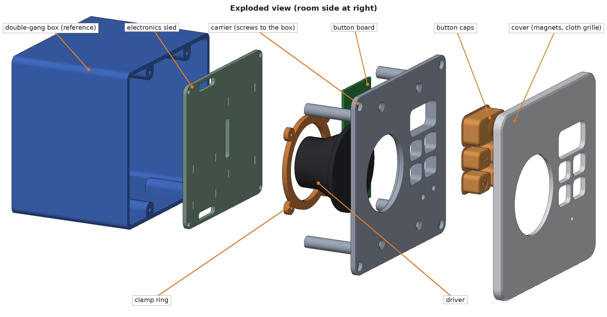
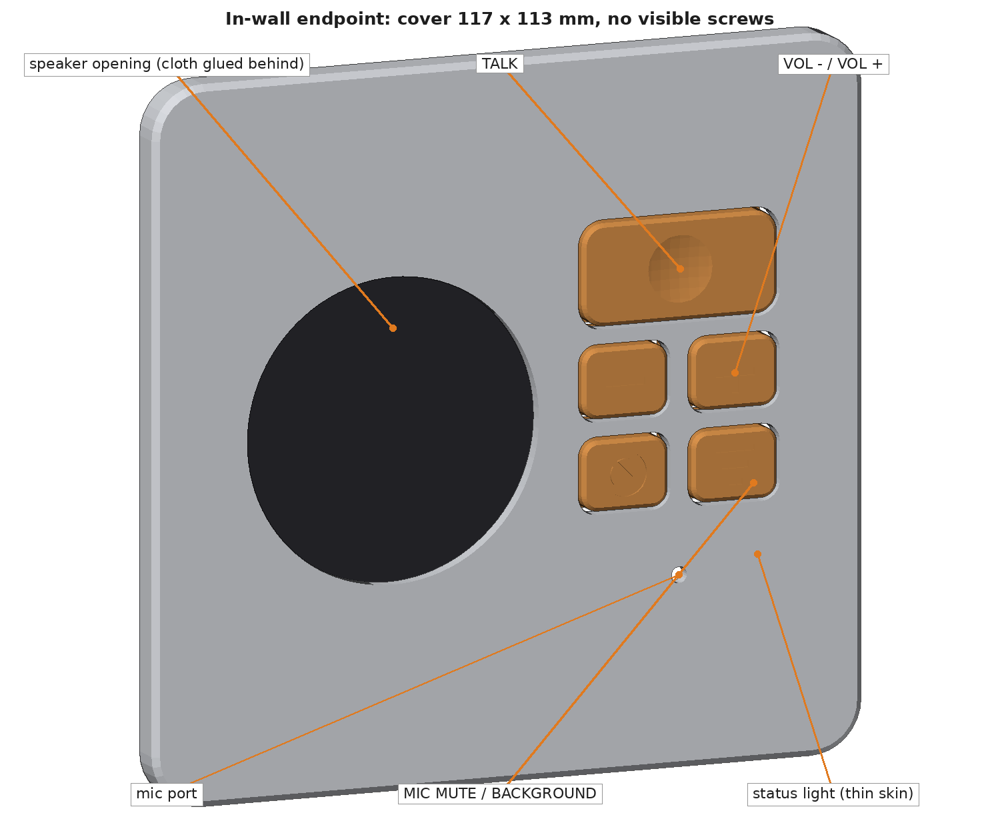
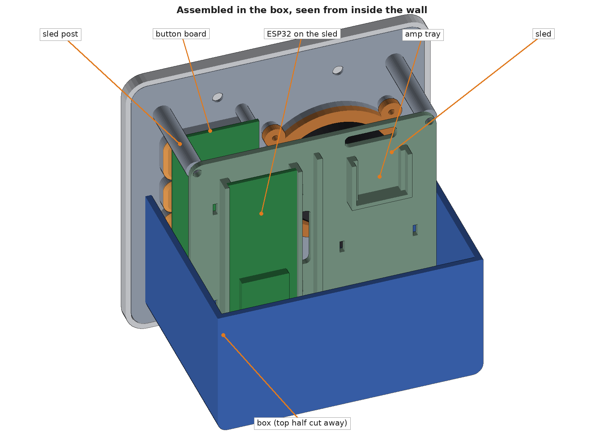

# Holler in-wall endpoint (optional)

An option for people who want speakers in the walls. It is not part of the reference build. The parts here are a first design: modeled and checked against each other and a reference box, but not yet printed or fitted to a real box.

The electronics, mic privacy circuit, buttons, and firmware are the same as the tabletop endpoint. See docs/design.md, section 3.1.



| | |
|---|---|
|  |  |

## What it is

- A standard double-gang new-work box (Carlon B232A class) used as a sealed speaker enclosure
- One 2 in. full-range driver (Dayton Audio CE52N-4) and one MAX98357A amp
- ESP32-S3, with Ethernet and PoE preferred so one low-voltage cable powers and connects it
- INMP441 mic behind a gasketed port
- Five moving button caps: TALK, VOL -, VOL +, MIC MUTE, BACKGROUND
- A cover held on by magnets, so no screws show

## Parts

| File | What it is | Print orientation |
|---|---|---|
| `carrier.stl` | Plate that screws to the box's four device holes and carries everything | Front face on the bed |
| `sled.stl` | Electronics plate that screws to the carrier's four posts | Flat, trays up |
| `cover.stl` | Wall plate, 117 x 113 mm | Front face on the bed |
| `button_caps.stl` | All five caps on one plate | Cap tops on the bed |
| `driver_ring.stl` | Clamp ring for the driver | Flat |
| `box_reference.stl` | The electrical box, for fit checks. **Do not print** | |

PETG, no supports. The carrier's sled posts are 35 mm tall and 7 mm across; slow down for them if they wobble.

## Hardware

| Item | Qty |
|---|---|
| 6-32 flat-head device screw (usually supplied with the box) | 4 |
| M3 heat-set insert and M3 x 6 screw (sled to posts) | 4 |
| M2 heat-set insert and M2 x 6 screw (driver ring) | 4 |
| M2 x 5 self-tapping screw (button board) | 4 |
| 6 x 2 mm disc magnet (4 in the carrier, 4 in the cover) | 8 |
| 6x6 mm tact switch | 5 |
| Speaker cloth, foam gasket tape | |

## Assembly

1. Press the inserts into the sled posts and the driver clamp bosses. Glue the magnets into the carrier and the cover with matching polarity.
2. Seat the driver in the carrier and clamp it with the ring.
3. Drop the five caps into their collars from the back, then screw the button board onto its standoffs. The board holds the caps in.
4. Seat the mic in its pocket, port toward the room.
5. Fit the ESP32 and amp to the sled, wire everything, and screw the sled to the posts.
6. Screw the carrier to the box with the four device screws, with foam tape between the carrier and the wall.
7. Glue cloth behind the cover's speaker opening, put a foam ring around the mic port, and set the cover on.

## Change it

Every dimension is a named parameter at the top of `inwall_endpoint.py`:

```
pip install manifold3d trimesh numpy pillow
python3 inwall_endpoint.py     # writes the STLs and prints fit checks
python3 render_views.py        # writes preview images to renders/
```

The script reports the overlap between every pair of parts, the dummy components, and the box. All should be zero.

Dimensions marked `VERIFY` are estimates. The ones that matter most: the box's interior size and how far its screw bosses reach in, the driver's flange and basket, the mic board's diameter and port position, and the ESP32 board footprint. The tray fits a DevKitC-1; a PoE board will need `ESP_BOARD` changed.

## Before installing in a wall

- Use PoE or a listed low-voltage supply. Do not put line voltage and the endpoint's wiring in the same box without a listed barrier.
- Use in-wall-rated cable, and follow local electrical code.
